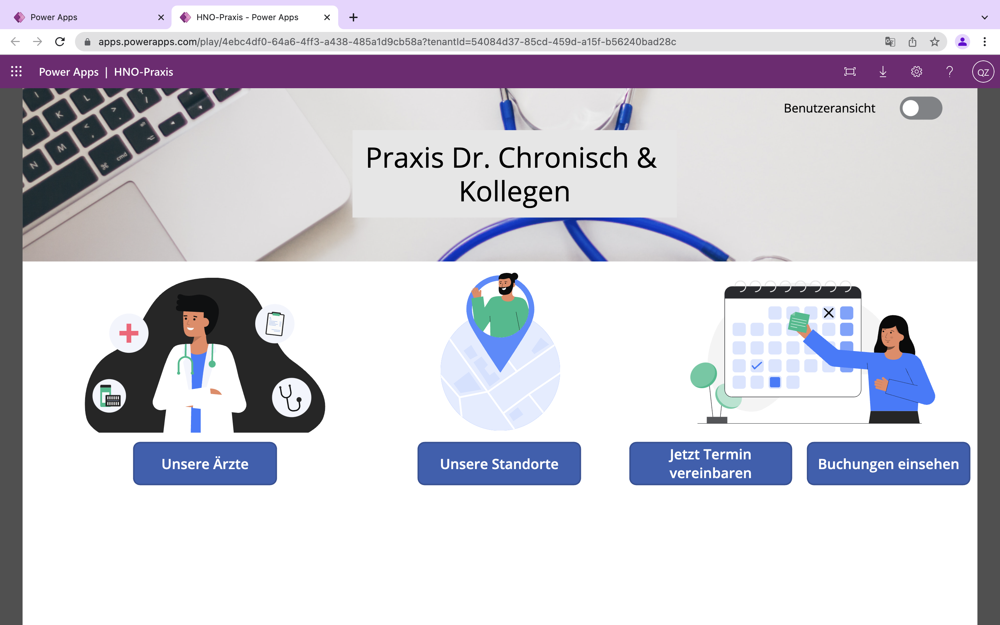

 

<h3>HNO-Praxis Booking System</h3>

## About The Project

The Applications goal is to offer a booking Platform for an ambulant hospital company, serving in several offices with multiple doctors in each office.
The project was a task during our lecture of model-driven software development with the Low-Code/No-Code platforms Mendix & Microsoft PowerApps.

The main folder is a clone of the Microsoft PowerApps Canva Application. Its also importable as solution via the .zip file.
The App isn't useable due to the access limitations only to tentant internals of Microsofts PowerPlattform.

### Built With

* [Microsoft PowerApps](http://powerapps.microsoft.com)

